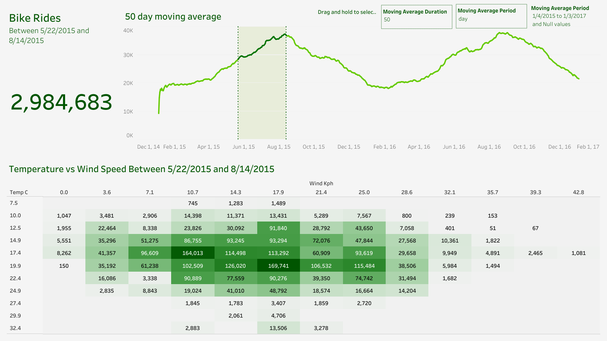

# Bike Rides Analysis

## Project Overview

This project presents a comprehensive analysis of bike ride behavior, focusing on how weather conditions and seasonal trends influence usage patterns. Through interactive visualizations and exploratory data analysis, the goal is to support data-driven decision-making for urban planners, transportation agencies, and mobility service providers.

By uncovering correlations between environmental factors and ridership, the project provides practical recommendations to improve bike-sharing infrastructure, optimize resource allocation, and enhance user experience.

---

## Visual Summary

### Tableau Dashboard Overview

  
An interactive dashboard that presents time-based trends, weather-driven behavior, and dynamic filters for analyzing bike ride patterns. Designed for usability across teams—from operations and logistics to policy and marketing.

---

## Business Value & Strategic Applications

| Business Area            | Strategic Impact                                                                 |
|--------------------------|-----------------------------------------------------------------------------------|
| **Urban Planning**       | Helps optimize infrastructure planning based on ride density and seasonality.    |
| **Transportation Ops**   | Informs staffing, bike availability, and maintenance scheduling.                 |
| **Marketing & Outreach** | Enables weather-aware campaigns and rider engagement strategies.                 |
| **Data Strategy**        | Demonstrates the use of analytics and dashboards in real-world mobility use cases.|

This analysis equips stakeholders with insight into peak demand periods, weather dependencies, and behavior trends to drive efficiency and rider satisfaction.

---

## Project Highlights

### Dynamic Moving Average Analysis
- Applied customizable moving averages to reveal short-term fluctuations and long-term seasonal trends.
- Helps operators identify patterns that aren’t visible in raw time series data.

### Weather Impact Analysis
- Explored the relationship between ride volume and variables like temperature and wind speed.
- Used heatmaps to visually communicate optimal cycling conditions for city-wide planning.

### Interactive Tableau Dashboard
- Developed an executive-friendly dashboard featuring:
  - Ride volume trends
  - Seasonal variation
  - Weather impact heatmaps
  - Custom filters for flexible exploration

---

## Python Workflow Summary

### 1. Data Extraction & Cleaning
- Loaded public dataset using `Pandas`
- Removed missing values, duplicates, and standardized column types for reliable analysis

### 2. Exploratory Data Analysis (EDA)
- Investigated daily and monthly ride trends
- Performed correlation analysis between ride counts and weather indicators

### 3. Actionable Insights
- Identified peak usage conditions and recommended targeted service enhancements
- Suggested operational improvements during low-demand or adverse weather periods

---

## Tools & Technologies

- **Data Handling**:  
  - `Pandas`

- **Visualization**:  
  - `Tableau`  
  - `Matplotlib`  
  - `Seaborn`

- **Development Environment**:  
  - Jupyter Notebook

---

## Insights & Recommendations

| Insight                                   | Business Implication                                                                 |
|------------------------------------------|---------------------------------------------------------------------------------------|
| High ride volumes in mild weather         | Forecast demand and promote usage during optimal weather conditions.                 |
| Decline in usage during high wind speeds  | Adjust marketing or operations strategy accordingly on poor weather days.            |
| Weekly and monthly seasonality trends     | Use insights to inform capacity planning and seasonal promotions.                    |
| Interactive visuals facilitate engagement | Decision-makers can quickly explore scenarios and act without technical deep-dives.  |

---

## For Recruiters

### Skills Demonstrated:
- **Data Cleaning & Transformation**  
- **Visual Analytics & Dashboarding**  
- **Trend Analysis & Business Interpretation**

### Tools Applied:
- `Python (Pandas, Seaborn, Matplotlib)`  
- `Tableau (Interactive Dashboards)`

### Business Impact:
- Supported urban and operational decision-making through weather- and time-driven insights  
- Translated raw mobility data into practical recommendations for real-world improvements

---

## Contact

For collaboration, implementation, or questions, please connect via [LinkedIn – Vedant Shinde](https://www.linkedin.com/in/vedantshinde25).
